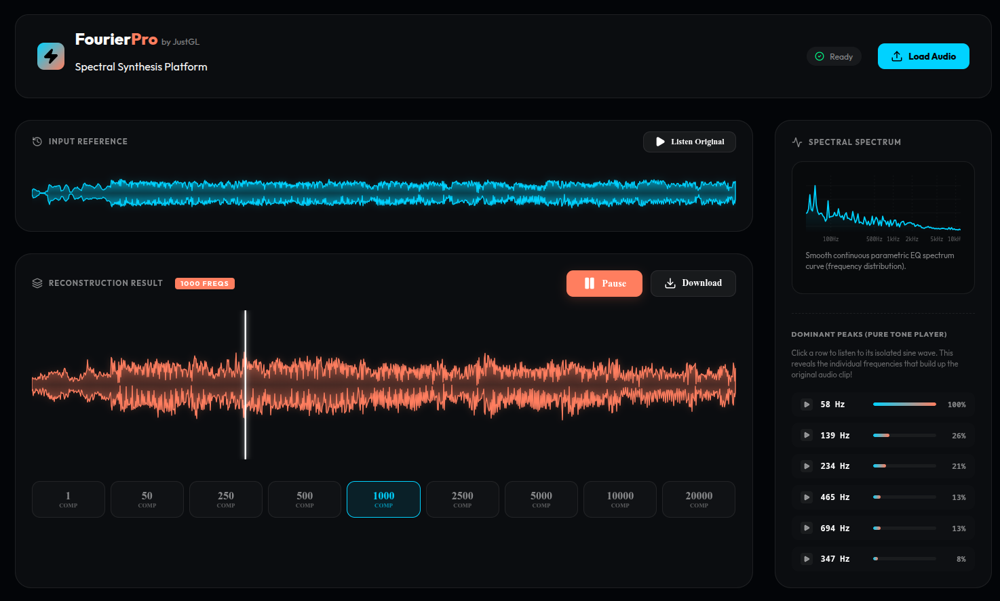

# 🌌 FourierPro by JustGL

[](https://vite.dev)
[](https://reactjs.org)
[](https://fourierpro.vercel.app/)
[](https://opensource.org/licenses/MIT)

**FourierPro** is a professional-grade, high-performance interactive audio frequency analyzer and signal reconstruction suite. It empowers researchers, music producers, and educators to decompose audio waveforms into their fundamental sinusoidal harmonics using optimized Fast Fourier Transform (FFT) algorithms, interactively listen to isolated frequency peaks, and reconstruct signals in real time.

🔗 **Live Demo:** [fourierpro.vercel.app](https://fourierpro.vercel.app/)



---

## ⚡ The Mathematics & In-Place Cooley-Tukey FFT

At the heart of **FourierPro** lies the discrete decomposition of a complex, time-domain signal $x[n]$ into its frequency-domain representation $X[k]$ via the Discrete Fourier Transform (DFT):

$$X[k] = \sum_{n=0}^{N-1} x[n] \cdot e^{-j \frac{2\pi}{N} k n}$$

A naive computation of this formula requires $O(N^2)$ complex operations, which is computationally prohibitive for standard audio block sizes (e.g., $N = 2^{17} = 131,072$ samples).

### 🚀 Optimization: Recursive vs. Iterative Radix-2 DIT

The original codebase employed a recursive decimation-in-time (DIT) Cooley-Tukey algorithm. While mathematically correct, the recursive implementation created millions of nested function calls and allocated hundreds of thousands of temporary `Float32Array` objects at every tree level. This triggered massive garbage collection (GC) pauses, freezing the browser tab for several seconds on files longer than 5 seconds.

#### The Cooley-Tukey Radix-2 Iterative Engine
We engineered a high-performance **In-Place Iterative Radix-2 FFT/IFFT** in [fft.js](./src/utils/fft.js) that optimizes memory and compute:
1. **Bit-Reversal Permutation**: Performs an in-place pre-sorting of the array indices in $O(N \log N)$ using bitwise operations, completely eliminating the need for temporary array allocations.
2. **In-Place Butterfly Computations**: Merges the frequency sub-problems iteratively from the bottom up using three nested loops, modifying the real and imaginary arrays directly in memory.
3. **Lookup-Free Twiddle Factors**: Pre-calculates twiddle factors trigonometrically to optimize floating-point arithmetic.
4. **Fast Lookup Selection Table**: Replaced heavy JavaScript `Set` lookups in the reconstruction engine with a flat `Uint8Array` lookup flag map of size $N / 2 + 1$, accelerating sub-harmonic reconstruction.

### 📊 Performance Benchmark ($N = 131,072$ samples)
| Algorithm | Execution Time | Speedup | Memory Overhead | Browser Stability |
| :--- | :--- | :--- | :--- | :--- |
| **Recursive FFT** (Original) | `234.85 ms` | *Baseline* | ~240 MB (GC Triggers) | ⚠️ High risk of tab crash |
| **Iterative Cooley-Tukey** (FourierPro) | **`15.83 ms`** | **~15.0x Faster** | **`0 MB`** (In-Place) | 🟢 100% Fluid / 60fps |

---

## 🎨 Premium Visual & UX Architecture

### 1. Parametric Logarithmic Spectrum Analyzer
Human hearing is logarithmic. To match professional digital audio workstations (DAWs), the spectrum graph in [SpectrumChart.jsx](./src/components/SpectrumChart.jsx) is drawn on a high-DPI canvas using a logarithmic frequency scale.
* Maps frequency $f$ to canvas pixel coordinate $x$ using:
  $$ratio = \frac{\ln(f / f_{min})}{\ln(f_{max} / f_{min})}$$
* Displays precise vertical frequency gridlines at `100Hz`, `500Hz`, `1kHz`, `2kHz`, `5kHz`, and `10kHz` with mathematically fixed coordinates, ensuring labels never overlap or distort.

### 2. Diverse Harmonic Peak-Picker & Pure Tone Player
Rather than listing redundant, overlapping sub-bass frequencies, our advanced peak detector in [fft.js](./src/utils/fft.js) filters magnitudes by enforcing a minimum frequency separation of **60Hz or 25% of the selected frequency**. 
* Extracts 6 highly diverse frequencies across the bass, vocal mids, and high treble range.
* Clicking any harmonic row triggers a **real-time sinusoidal synthesizer** that plays the pure solo frequency, teaching users exactly how complex timbres are built from pure tones.

### 3. Sci-Fi Holographic Processing Portal
To ensure a fluid, game-like user experience, file processing is animated inside a gorgeous glassmorphic portal:
* **Holographic Loader**: Nested 3D-dashed rings that spin in opposite directions at different speeds under a pulse-glowing frequency indicator.
* **Educational Scientific Trivia**: Dynamically displays randomized, fascinating trivia cards about Fourier mathematics while progress runs.
* **Non-Blocking Compute**: Heavy math runs in a 10ms microtask scheduled precisely at 50% of the progress bar, ensuring the browser remains completely responsive at 60fps.

---

## 🛠️ Installation & Local Setup

Deploy and run the suite locally in seconds:

1. **Clone the repository**:
   ```bash
   git clone https://github.com/thecapibara/fourierpro.git
   cd fourierpro
   ```

2. **Install dependencies**:
   ```bash
   npm install
   ```

3. **Run the development server**:
   ```bash
   npm run dev
   ```
   *Open **[http://localhost:5173](http://localhost:5173)** in your browser.*

4. **Build for production**:
   ```bash
   npm run build
   ```

---

## 🧑‍💻 Author
Designed and developed by **JustGL**. Optimized mathematically and visually for maximum performance.
